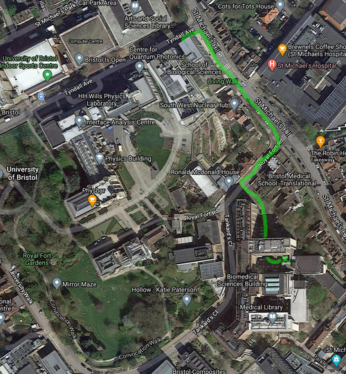

# Protocol for PCR amplifying and sequencing COI and 12S DNA barcodes
### Rupert A. Collins :: December 2020

This protocol is for generating DNA barcodes for the standard COI DNA barcode marker and the 12S MiFish barcode, by Sanger sequencing. Choice of polymerase mastermix depends on if you want to sequence purified or unpurified products (use green mix for former, and colourless mix for latter). With Eurofins, unpurified products can be sequenced only in 96-well plates (PlateSeq Kit PCR), but purified products can be sequenced in 96-well plates (PlateSeq Kit Mix) or ad-hoc in individual tubes (Mix2Seq Kit). Sequencing unpurified products is the cheapest option and the least work, but requires very consistent PCR products.

### Before you start

#### Kit required (manufacturers and part numbers are presented in Table 4 at the bottom)

* Polymerase mastermix (GoTaq green for sequencing purified products, GoTaq colorless for sequencing unpurified products).
* Primers.
* DNA template.
* Molecular grade water (DNase/RNase free).
* A pre-paid sequencing kit (e.g. Mix2Seq).
* 1.5 mL microcentrifuge tubes.
* 8-strip PCR tubes, or 96-well plate with 8-strip caps.
* 10/20 &micro;L XL filter tips.
* 200 &micro;L filter tips.
* Gel electrophoresis tank, agarose, DNA ladder, gel stain.
* Spin columns and buffers (if purifying)
* Bleach and 70% ethanol to clean bench.
* Paper towels and disposible gloves etc.

#### Making working stocks (eDNA lab)

* Make working stock solutions in the eDNA lab with brand new reagents that have not been the main lab. Do not enter the eDNA lab if you have handled PCR products that day. Always use filter tips.
* Make aliquots (subsamples) of the polymerase mastermix, e.g. 250 &micro;L, and return all but one to freezer. This helps prevent contaminating the mastermix stock and will reduce freeze-thaw damage to the polymerase.
* Make ~1 mL aliquots of molecular grade water. Pour the water into the tube from the bottle; never put pipette into the bottle. 
* Prepare stocks of primers at 10 &micro;M and 2 &micro;M. To make 200 &micro;L of 10 &micro;M primer, add 20 &micro;L of 100 &micro;M stock to 180 &micro;L of water. To make 200 &micro;L of 2 &micro;M primer, add 40 &micro;L of 10 &micro;M stock to 160 &micro;L of water

#### Get ready (main lab: pre-PCR benches)

* In the main lab wipe down the bench with 70% ethanol followed by 10% bleach, followed by 70% ethanol (the "EBE" ethanol-bleach-ethanol clean).
* Ensure you have sufficient gloves, towels, tips, sweetie jars, tubes etc.
* Defrost reagents to room temperature (place on ice if not preparing mix immediately).

### Preparing the PCR supermix (main lab: pre-PCR benches)

1. In a 1.5 mL microcentrifuge tube, mix reagents sufficient for all of your samples, plus a negative control (water), a positive control (a sample that has worked previously in the lab), and roughly 10% extra to account for pipetting error (see Table 1). Total PCR reaction volume is 20 &micro;L, but if you don't intend to sequence and want to run a test, you can scale down to 10 &micro;L reactions.

#### Table 1. A PCR supermix for 6 samples (total n=9 including negative control, positive control and ~10% extra) at 20 &micro;L total reaction volume.
Reagent | Volume n=1 | Volume n=9
--- | --- | ---
GoTaq mastermix | 10 &micro;L  | 90 &micro;L 
Primer forward (2 &micro;M) | 2 &micro;L  | 18 &micro;L 
Primer reverse (2 &micro;M) | 2 &micro;L  | 18 &micro;L 
Molecular grade water  | 5 &micro;L  | 45 &micro;L 

2. Vortex the supermix thoroughly. It does not need to be kept on ice, if you intend to use it immediately.
3. Normalise your DNA extracts (template) to 50 ng/&micro;L in a new 1.5 mL microcentrifuge tube (~10 &micro;L total). Remember to vortex. A handy resource for calculating DNA concentrations is [http://www.desiquintans.com/dilutioncalc](http://www.desiquintans.com/dilutioncalc). If your DNA extracts are less than 50 ng/&micro;L, then use them straight. If the PCR products come out messy or genomic DNA is visible on the gel, normalise to a lower concentration. 
4. Add 19 &micro;L of the supermix into the PCR strip tubes or plate wells (can use the same pipette tip). The strip tubes can be broken apart into smaller strips if needed.
5. Using a new tip each time, add 1 &micro;L of the normalised DNA template to the top of each well so the droplet remains visible on the side (so you can see that you've done it, in case you get distracted), and close the cap. Use 1 &micro;L of water for the negative control.
6. Once all have been added, number and write on the caps corresponding to your lab notes.
7. Spin down tubes in the salad spinner or the mini-centrifuge.
8. Take to the PCR machines (thermocyclers).
9. If using the Eppendorf machines, make sure that when you add your tubes to the block, that they fit snugly in the *small* holes, not the big holes.
10. If using only a few tubes, it's a good idea to put one empty tube in each corner of the block to ensure that the lid does not damage the tube caps.
11. Program the machine as follows according to your gene target:

#### Table 2. Thermocycling parameters for GoTaq polymerase mastermix (important note: if using a different brand of polymerase mastermix, then follow thermocyling parameters according to those instructions, not these). Try to avoid leaving the machine on hold all night.
Step | Cycles | Temperature | Time
--- | --- | --- | ---
Initial denaturation | 1 | 95&#176;C | 2 min
Denaturation | 40 | 95&#176;C | 30 sec
Annealing | 40 | see Table 3. | 30 sec
Extension | 40 | 72&#176;C | 45 sec
Final extension | 1 | 72&#176;C | 5 min
Hold | 1 | 10&#176;C | Inf

#### Table 3. Primer sequences and annealing temperatures for common 12S and COI primer pairs. Amplicon length includes primers. See Sequencing section for advice on which primer set to use.
Primer | Reference | Gene | Direction | Amplicon length | Sequence (5\`-3\`) | Annealing temp.
--- | --- | --- | --- | --- | --- | ---
Aa22-12SF | Collins (unpublished) | 12S | Forward | ~612 bp | AGCATAACACTGAAGATRYTARGA | 53&#176;C
Aa633-12SR | Collins (unpublished) | 12S | Reverse | ~612 bp | TTCTAGAACAGGCTCCTCTAG | 53&#176;C
MiFish-U-F | Miya et al. (2015) | 12S | Forward | ~219 bp | GTCGGTAAAACTCGTGCCAGC | 60&#176;C
MiFish-U-R | Miya et al. (2015) | 12S | Reverse | ~219 bp | CATAGTGGGGTATCTAATCCCAGTTTG | 60&#176;C
FishF1 | Ward et al. (2005) | COI | Forward | 707 bp | TCAACCAACCACAAAGACATTGGCAC | 52&#176;C
FishR1 | Ward et al. (2005) | COI | Reverse | 707 bp | TAGACTTCTGGGTGGCCAAAGAATCA | 52&#176;C
LCO1490 | Folmer et al. (1994) | COI | Forward | 709 bp | GGTCAACAAATCATAAAGATATTGG | 48&#176;C
HCO2198 | Folmer et al. (1994) | COI | Reverse | 709 bp | TAAACTTCAGGGTGACCAAAAAATCA | 48&#176;C

### Gel electrophoresis (main lab: post-PCR bench)

1. Prepare a 1% agarose gel to visualise the PCR amplicons: 1 g agarose powder, 100 mL 0.5x TBE buffer, 3 &micro;L GelRed stain. Make the gel no thicker than 5 mm.
2. In the TBE electrophoresis tank, directly load 2-3 &micro;L of DNA Ladder III into the first well. Use 10 &micro;L loose tips from the gel bench. Never use boxed filter tips, and never use pipettes that are not from the post-PCR gel bench.  
3. Directly load 2 &micro;L (3 &micro;L for the wider combs) of each PCR product into the wells. The PCR products already contain loading dye.
4. Run the gel at 100v (5v/cm) for 30-45 mins. The yellow part of the GoTaq loading dye migrates about as fast as primer dimer, so stop the gel just before the yellow band leaves the gel.
5. Visualise in the UV hood. Products should be bright and clean, a single band, and of the expected length. Primer dimers or free primers will be a faint smudge or band near the bottom ladder. Unless really bright, these are not a big problem and are removed during purification. Bright primer dimer bands indicate excessive primer concentration or poorly designed primers that cross-bind.
6. In the gel below some non-specific amplification is apparent (faint bands above and below the main products) and the products are somewhat too strong (reducing number of cycles to 35, using lower concentration template, or increasing the annealing temp by 1-2&#176;C will improve these. Primer dimer is apparent as the bottom band. Because they are so strong, these products could be taken forward to sequence, but further optimisation of the PCR will produce more reliable results. The better the gel looks, the better the sequence data!

#### Figure 1. Gel of varying length amplicons.  

7. Re-cap the PCR tubes and store in the fridge. For storage longer than 1 week, place in a labelled plastic bag and store in the chest freezer. 

### Purification (main lab: post-PCR bench)

Purification removes leftover DNTPs, primers, primer dimers, and polymerase etc, and also allows for accurate quantification of concentration. If unpurified products are to be sequenced (PlateSeq Kit PCR), the concentration still needs to be estimated. Purify (as below) a minimum of three representative products and take an average. Assume all others are similar enough to these. If purified products are to be sequenced (PlateSeq Kit Mix, Mix2Seq Kit), all products need to purified as follows (per PCR reaction):

1. Take 15 &micro;L of PCR product and pipette into a new 1.5 mL microcentrifuge tube, and add 75 &micro;L of DNA binding buffer. Vortex.
2. Insert a Zymo spin column into a new 1.5 mL microcentrifuge tube (cap removed). 
3. Pipette the 90 &micro;L of mixture into the spin column, carefully from the bottom filling up.
4. Centrifuge at top speed (14.1 rcf) for 1 min, and transfer the column into a new 1.5 mL microcentrifuge tube (cap removed). Discard the flow-through and tube.
5. Add 200 &micro;L of DNA wash buffer, carefully from the bottom filling up.
6. Centrifuge at top speed for 1 min, remove column and secure between fingers, and pipette out the 200 &micro;L from the bottom of the tube and dicard the tip.
7. Place column back into the same tube and repeat wash with 200 &micro;L of DNA wash buffer, centifuge, pipette and discard buffer as before. 
8. Centrifuge "dry" for 2 min to remove remaining wash buffer.
9. Transfer column to a new 1.5 mL microcentrifuge tube (cap removed) and leave with the column cap open for 2 min to evaporate final wash buffer traces.
10. Add 15 &micro;L EB buffer (10 mM Tris) carefully and directly onto the column matrix. Do not use buffers that contain EDTA (TE buffer, Qiagen AE buffer). Zymo Elution Buffer contain low concentrations of EDTA (0.1 mM), so probably okay. Molecular grade water can work, but can also be problematic if the products are weak and water pH < 6.
11. Incubate at room temp for 1 min.
12. Centrifuge for 1 min. 
13. Transfer to a new 1.5 mL microcentrifuge tube (with cap, labelled).
14. Quantify 1 &micro;L on the nanodrop. Record concentration (ng/&micro;L) and purity ratios.

### Sequencing with Mix2Seq (main lab: post-PCR bench)

Sanger sequencing requires a reaction including the addition of a single primer, unlike PCR which requires two primers. The DNA sequence returned can be up to ~900 bp, but the sequencing primer sites and at least 
~30 bp downstream will not be usable. Bear this in mind when choosing which PCR primer to use as sequencing primer, as if you want the entire sequence, you will need to sequence in both directions, which requires two different sequencing reactions (one primer for each).

For 12S fish metabarcoding reference libraries, first try to PCR the Aa primer set because this generates a ~567 bp fragment that includes the MiFish fragment and its priming sites in one sequencing reaction (I sequence with Aa633-12SR). If Aa fails to amplify for some samples, then use the MiFish primers, but remember that it will require two sequencing reactions (forward and reverse) to get the whole MiFish fragment (necessary for taxonomic assignment).

For COI, sequencing just the forward primer (FishF1) will give you ~630 bp usable sequence, which is good for most applications. If the full 655 bp barcode is required (e.g. type material or species description), then it should be sequenced in both directions. 

1. Follow the enclosed instructions for submitting samples for sequencing with Eurofins kits. Adjust according to their fragment length recommendations.
2. For 300-1000 bp amplicons with Mix2Seq, the required DNA concentration is 5 ng/&micro;L in 15 &micro;L, (total required = 75 ng).
3. Add 75 ng to the Mix2Seq tube, and dilute your sample accordingly at [http://www.desiquintans.com/dilutioncalc](http://www.desiquintans.com/dilutioncalc) by topping up to 15 &micro;L with molecular grade water.
4. Add 2 &micro;L of the sequencing primer at 10 &micro;M.
5. Write the Mix2Seq barcode ID codes in your lab book corresponding to each sample.
6. Seal and put the Mix2Seq tubes in a small plastic baggy and write the number of tubes on the bag.
7. Place in a small padded envelope and write the Eurofins address (provided with the kit) on the envelope, or use their provided stickers.
8. Take the envelope to Biomedical Sciences stores (see Figure 2) and ask the stores manager to put in the Eurofins dropbox for you. Say thank you.
9. Sequencing results will be emailed to the Eurofins account holder within 48 hours usually.

#### Figure 2. Location of Eurofins dropbox at Biomedical Sciences stores.  

### Table 4. Parts and prices
Item | Type | Quantity | Cost (excl. VAT)| Company | Part no.
--- | --- | --- | --- | --- | ---
GoTaq G2 master mix (green) | consumable | 2 x 1,250 &micro;L | £56.25 | Promega UK | M7822
GoTaq G2 master mix (colorless) | consumable |2 x 1,250 &micro;L | £56.25 | Promega UK | M7832
UltraPure DNase/RNase free water | consumable | 500 mL | £10.96 | Thermo Fisher Scientific | 10977035
10/20 &micro;L XL filter tip | consumable | 10 boxes | £36.98 | Starlab UK | S1120-3710
200 &micro;L filter tip | consumable | 10 boxes | £36.98 | Starlab UK | S1120-8710
1.5 mL microcentrifuge tube | consumable | 500 | £14.28 | Starlab UK | S1615-5510
96-well PCR plate | consumable | 20 | £34.68 | Starlab UK | E1403-0200
8-strip PCR caps | consumable | 125 | £10.11 | Starlab UK | I1400-0800
8-Strip PCR tubes | consumable | 120 | £51.70 | Starlab UK | I1402-2900
Ladder III | consumable | 5 x 500 &micro;L | £149.6 | PCR Biosystems | PB40.13-05
GelRed nucleic acid stain | consumable | 5 x 0.5 mL | £432.25 | Cambridge Bioscience | 41003-5-BT
Zymo DNA binding buffer | consumable | 100 mL | £49.28 | Cambridge Bioscience | D4004-1-L
Zymo DNA Wash Buffer | consumable | 24 mL | £29.26 | Cambridge Bioscience | D4003-2-24
Zymo spin IC columns | consumable | 250 | £180.18 | Cambridge Bioscience | C1004-250
PlateSeq Kit PCR | consumable | 96 reactions | £270.00 | Eurofins Genomics | Off marketplace
PlateSeq Kit Mix | consumable | 96 reactions | £250.75 | Eurofins Genomics | Off marketplace
Mix2Seq Kit | consumable | 96 reactions | £290.00 | Eurofins Genomics | Off marketplace
