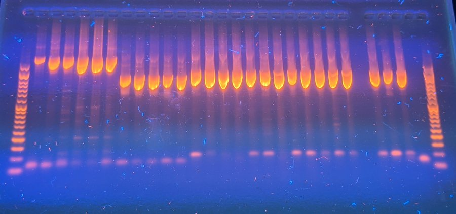

# Protocol for PCR amplifying COI and 12S DNA barcodes
### Rupert A. Collins :: December 2020

This protocol is for generating DNA barcodes for the standard COI DNA barcode marker and the 12S MiFish barcode, by Sanger sequencing. Choice of polymerase mastermix depends on if you want to sequence purified or unpurified products (use green mix for former, and colourless mix for latter). With Eurofins, unpurified products can only be sequenced in 96-well plates (PlateSeq Kit PCR) but purified products can be sequenced in 96-well plates (PlateSeq Kit Mix) or ad-hoc in individual tubes (Mix2Seq Kit). Sequencing unpurified products is the cheapest option and the least work, but requires very consistent PCR products.

### Before you start

#### Kit required (manufacturers and part numbers are presented in Table 1 at the bottom): 

* GoTaq green mastermix (for sequencing purified products)
* GoTaq colorless mastermix (for sequencing unpurified products)
* Molecular grade water (DNase/RNase free)
* A pre-paid sequencing kit (e.g. Mix2Seq)
* 1.5 mL microcentrifuge tubes
* 8-strip PCR tubes, or 96-well plate with 8-strip caps
* 10/20 &micro;L XL filter tips
* 200 &micro;L filter tips
* Gel electrophoresis tank and DNA ladder
* Bleach
* 70% ethanol
* Paper towels
* Disposible gloves

#### Things to do before you start:

* Work in the main lab, not the eDNA lab.
* Wipe down the bench with 70% ethanol followed by 10% bleach, followed by 70% ethanol (the "EBE" ethanol-bleach-ethanol clean).
* Ensure you have sufficient gloves, towels, tips, sweetie jars, tubes etc.
* Defrost reagents to room temperature.
* Make aliquots (subsamples) of the GoTaq PCR mastermix, e.g. 250 &micro;L, and return all but one to freezer. This helps prevent contaminating the mastermix stock and will reduce freeze-thaw damage to the polymerase.
* Make ~1 mL aliquots of molecular grade water. Pour the water into the tube from the bottle; never put pipette into the bottle. 
* Prepare stocks of primers at 10 &micro;M and 2 &micro;M. Prepare these in the eDNA lab using filter tips. To make 200 &micro;L of 10 &micro;M primer, add 20 &micro;L of 100 &micro;M stock to 180 &micro;L of water. To make 200 &micro;L of 2 &micro;M primer, add 40 &micro;L of 10 &micro;M stock to 160 &micro;L of water

### Preparing the PCR supermix:

1. In a 1.5 mL microcentrifuge tube, mix reagents sufficient for all of your samples, plus a negative control (water), a positive control (a sample that has worked previously in the lab), and roughly 10% extra to account for pipetting error (see Table 1). Total PCR reaction volume is 20 &micro;L.

#### Table 1. A PCR supermix for 6 samples (total n=9 including negative control, positive control and ~10% extra) at 20 &micro;L total reaction volume.
Reagent | Volume n=1 | Volume n=9
--- | --- | ---
GoTaq mastermix | 10 &micro;L  | 90 &micro;L 
Primer Forward (2 &micro;M) | 2 &micro;L  | 18 &micro;L 
Primer Reverse (2 &micro;M) | 2 &micro;L  | 18 &micro;L 
Molecular grade water  | 5 &micro;L  | 45 &micro;L 

2. Vortex the supermix thoroughly. It does not need to be kept on ice, but do not leave it lying around at room temp for hours.
3. Normalise your DNA extracts (template) to 50 ng/&micro;L in a new 1.5 mL microcentrifuge tube (~10 &micro;L total). A handy resource for calculating DNA concentrations is [http://www.desiquintans.com/dilutioncalc](http://www.desiquintans.com/dilutioncalc). If your DNA extracts are less than 50 ng/&micro;L, then use them straight. Remember to vortex.
4. Using the same pipette tip, add 19 &micro;L of the supermix into the PCR strip tubes or plate wells. The strip tubes can be broken apart into smaller strips if needed.
5. Using a new tip each time, add 1 &micro;L of the normalised DNA template to the top of each well so the droplet remains visible on the side (so you can see that you've done it, in case you get distracted), and close the cap. Use 1 &micro;L of water for the negative control.
6. Once all have been added, number and write on the caps corresponding to your lab notes.
7. Spin down tubes in the salad spinner or the mini-centrifuge.
8. Take tube to the PCR machines (thermocyclers).
9. If using the Eppendorf machines, make sure when you add your tubes to the block, that they fit snugly in the *small* holes, not the big holes.
10. If using only a few tubes, it's a good idea to put one empty tube in each corner of the block to ensure that the lid does not damage the tube caps.
11. Program the machine as follows according to your gene target:

#### Table 2. Thermocycling parameters.
Step | Cycles | Temperature | Time
--- | --- | --- | ---
Initial denaturation | 1 | 95&#176;C | 2 min
Denaturation | 40 | 95&#176;C | 30 sec
Annealing | 40 | see Table 3. | 30 sec
Extension | 40 | 72&#176;C | 45 sec
Final extension | 1 | 72&#176;C | 5 min

#### Table 3. Primer sequences and annealing temperatures for common 12S and COI primers. Amplicon length includes primers.
Primer | Reference | Gene | Direction | Amplicon length | Sequence (5\`-3\`) | Annealing temp.
--- | --- | --- | --- | --- | --- | ---
Aa22-12SF | Collins (unpublished) | 12S | Forward | 612 bp | AGCATAACACTGAAGATRYTARGA | 53&#176;C
Aa633-12SR | Collins (unpublished) | 12S | Reverse | 612 bp | TTCTAGAACAGGCTCCTCTAG | 53&#176;C
MiFish-U-F | Miya et al. (2015) | 12S | Forward | 219 bp | GTCGGTAAAACTCGTGCCAGC | 60&#176;C
MiFish-U-R | Miya et al. (2015) | 12S | Reverse | 219 bp | CATAGTGGGGTATCTAATCCCAGTTTG | 60&#176;C
FishF1 | Ward et al. (2005) | COI | Forward | 707 bp | TCAACCAACCACAAAGACATTGGCAC | 52&#176;C
FishR1 | Ward et al. (2005) | COI | Reverse | 707 bp | TAGACTTCTGGGTGGCCAAAGAATCA | 52&#176;C
LCO1490 | Folmer et al. (1994) | COI | Forward | 709 bp | GGTCAACAAATCATAAAGATATTGG | 48&#176;C
HCO2198 | Folmer et al. (1994) | COI | Reverse | 709 bp | TAAACTTCAGGGTGACCAAAAAATCA | 48&#176;C

### Gel electrophoresis

12. Prepare a 1% agarose gel to visualise the PCR amplicons: 1 g agarose powder, 100 mL 0.5x TBE buffer, 3 &micro;L GelRed. Make the gel no thicker than 5 mm.
13. Directly load 2-3 &micro;L of DNA Ladder III into the last or first well in the TBE gel tank. Use 10 &micro;L loose tips from the gel bench. Never use boxed filter tips, and never use pipettes that are not from the gel bench.  
14. Directly load 2-3 &micro;L (more for the wider combs) of each PCR product into remaining wells. The PCR products already contain loading dye.
15. Run the gel at 100v (5v/cm) for 30-45 mins. The yellow part of the GoTaq loading dye migrates about as fast as primer dimer, so stop the gel before the yellow band leaves the gel.
16. Visualise in the UV hood. Products should be bright and clean, a single band, and of the expected length. Primer dimers or free primers will be a faint smudge or band near the bottom ladder. In the gel below some non-specific amplification is apparent (faint bands above and below the main products) and the products are somewhat too strong (reducing number of cycles to 35 and increasing the annealing temp by 1-2&#176;C will improve these. Primer dimer is apparent as the bottom band. Because they are so strong, these products can be taken forward to sequence, but further optimisation of the PCR will produce more reliable results. The better the gel looks, the better the sequence data!

#### Figure 1. Gel of varying length amplicons.  

18. Re-cap the PCR tubes and store in the fridge. For storage longer than 1 week, place in a labelled plastic bag and store in the chest freezer. 

### Purification and sequencing

20. Purification removes leftover DNTPs, primers, primer dimers, and polymerase etc. Allows for accurate quantification of concentration.
21. If unpurified products are to be sequenced (PlateSeq Kit PCR), the concentration still needs to be estimated. Purify (as follows) a minimum of three representative products and take an average. Assume all others are the similar enough to these.
22. If purified products are to be sequenced (PlateSeq Kit Mix, Mix2Seq Kit), all products need to purified as follows.
23. Take 15 &micro;L of PCR product and pipette into a new 1.5 mL microcentrifuge tube, and add 75 &micro;L of DNA binding buffer. Vortex.
24. For each sample, remove cap from 1.5 mL microcentrifuge tube and insert a Zymo spin column.
24. Pipette the 90 &micro;L of mix into the spin column carefully from the bottom up.
25. Centrifuge at top speed (14,000 g) for 

### Table 1. Parts and prices
Item | Type | Quantity | Cost (excl. VAT)| Company | Part no.
--- | --- | --- | --- | --- | ---
GoTaq G2 master mix (green) | consumable | 2 x 1,250 &micro;L | £56.25 | Promega UK | M7822
GoTaq G2 master mix (colorless) | consumable |2 x 1,250 &micro;L | £56.25 | Promega UK | M7832
UltraPure DNase/RNase free water | consumable | 500 mL | £10.96 | Thermo Fisher Scientific | 10977035
10/20 &micro;L XL filter tip | consumable | 10 boxes | £36.98 | Starlab UK | S1120-3710
200 &micro;L filter tip | consumable | 10 boxes | £36.98 | Starlab UK | S1120-8710
1.5 mL microcentrifuge tube | consumable | 500 | £14.28 | Starlab UK | S1615-5510
96-well PCR plate | consumable | 20 | £34.68 | Starlab UK | E1403-0200
8-strip PCR caps | consumable | 125 | £10.11 | Starlab UK | I1400-0800
8-Strip PCR tubes | consumable | 120 | £51.70 | Starlab UK | I1402-2900
Ladder III | consumable | 5 x 500 &micro;L | £149.6 | PCR Biosystems | PB40.13-05
GelRed nucleic acid stain | consumable | 5 x 0.5 mL | Cambridge Bioscience | £432.25 | 41003-5-BT
PlateSeq Kit PCR | consumable | 96 reactions | £270.00 | Eurofins Genomics | NA
PlateSeq Kit Mix | consumable | 96 reactions | £250.75 | Eurofins Genomics | NA
Mix2Seq Kit | consumable | 96 reactions | £290.00 | Eurofins Genomics | NA
Zymo DNA binding buffer | consumable | 100 mL | £49.28 | Cambridge Bioscience | D4004-1-L
Zymo DNA Wash Buffer | consumable | 24 mL | £29.26 | Cambridge Bioscience | D4003-2-24
Zymo spin IC columns | consumable | 250 | £180.18 | Cambridge Bioscience | C1004-250
