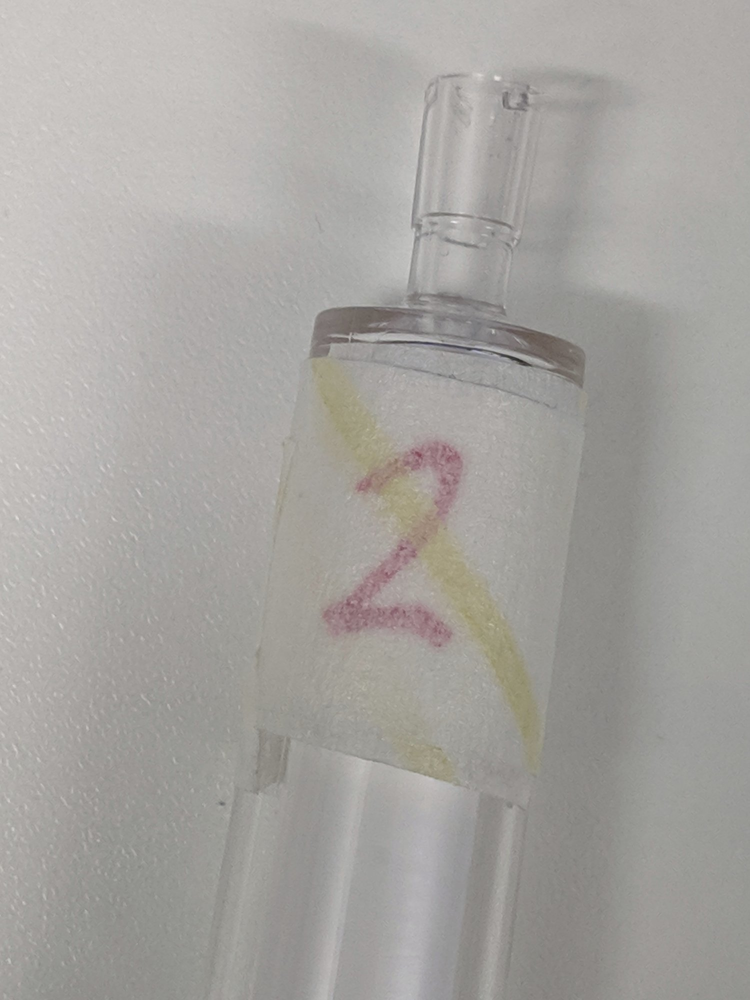
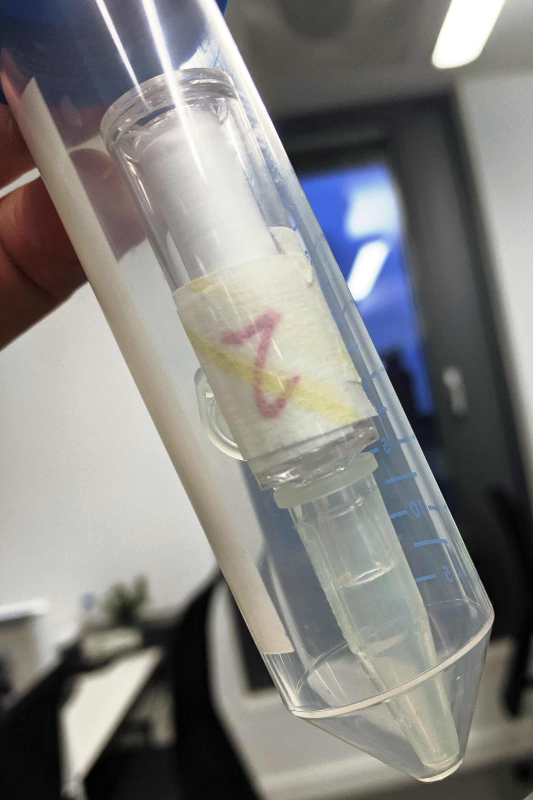

# Protocol for PCR amplifying COI and 12S DNA barcodes
### Rupert A. Collins :: December 2020

This protocol is for generating DNA barcodes for the standard COI DNA barcode marker and the 12S MiFish barcode. 

### Before you start

#### Kit required (manufacturers and part numbers are presented in Table 1 at the bottom): 

* GoTaq Green Master Mix
* 1.5 mL microcentrifuge tubes
* 10/20 &micro;L XL filter tips
* 200 &micro;L filter tips
* Bleach
* 70% ethanol
* Paper towels
* Disposible gloves

#### Things to do before you start:

* Work in the main lab, not the eDNA lab.
* Wipe down the bench with 70% ethanol followed by 10% bleach, followed by 70% ethanol (the "EBE" ethanol-bleach-ethanol clean).
* Ensure you have sufficient gloves, towels, tips, sweetie jars, tubes etc.

### Extraction steps:

1. Turn on the oven and preheat the AL and AE buffers at 56&#176;C.
2. Label the Sterivex by putting on masking tape, writing on the number, then another layer of tape. This means that the labels will not be lost should one of the Sterivex leak in the shaker. See:

3. Open the Sterivex, add 5 &micro;L of proteinase K and 2 &micro;L of RNase A. Close with the same combistopper and shake to mix.
4. Put in the oven shaker to incubate for 2 h. Return after 1 h to rearrange and check; this makes sure some samples don't get stuck and stop moving.
5. Remove combistopper and place an inverted 1.5 mL microcentrifuge tube over the Sterivex inlet. Place an inverted 50 mL centrifuge tube over the top of both. Quickly flip so tubes are back the right way up and the Sterivex contents can drain into the microcentrifuge tube. See:

6. Centrifuge for 1 min at 4,000 g.
7. With sterilised tweezers remove the Sterivex and discard. Then remove the 1.5 mL microcentrifuge tube carefully.
8. Centrifuge the sample for 1.5 min at 13,000 g to collect debris.
9. Transfer supernatant to a new 1.5 mL microcentrifuge tube. Take care to not disturb the pellet. Discard tube with debris.
10. Centrifuge again, but for 3 min at 20,000 g.
11. Transfer 350 &micro;L of supernatant to a new 1.5 mL microcentrifuge tube. Take care to not disturb any pellet. Discard tube with debris.
12. In a new 50 mL centrifuge tube prepare a mastermix of buffer AL (pre-warmed) and ethanol. You will need 350 &micro;L of each for every sample, plus 10% extra. So, for 5 samples, add 1,925 &micro;L of buffer AL and 1,925 &micro;L of ethanol. Vortex to mix.
13. Add 700 &micro;L of this mastermix to your supernatant, and vortex each samples IMMEDIATELY (important).
14. Add 525 &micro;L of this mixture from step 13 to the DNeasy spin column. take care to pipette the contents gently and from the bottom of the column to prevent salt contamination around the rim. 
15. Centrifuge for 1.5 min at 13,000 g.
16. Remove the column from the collection tube and carefully pipette out the liquid from the collection tube and discard this liquid by ejecting the full pipette tip.
17. Repeat steps 12/13 to pass another 525 &micro;L through the column.
18. Discard collection tube and contents, and place column in new collection tube.
19. Add 600 &micro;L buffer AW1 to the spin column and centrifuge for 1.5 min at 13,000 g. Be sure to add the buffer gently from the bottom as before.
20. Discard collection tube and contents, and place column in new collection tube. Be careful to not let the liquid touch the bottom of the spin column.
21. Add 600 &micro;L buffer AW2 to the spin column and centrifuge for 1.5 min at 13,000 g. Be sure to add the buffer gently from the bottom as before.
22. Use a pipette to remove the liquid from the collection tube as before. Be careful to not let the liquid touch the bottom of the spin column.
23. Centrifuge the spin column and empty collection tube again, this time for 3 min at 20,000 g.
24. Transfer the column to a new 1.5 mL microcentrifuge tube with the cap cut off.
25. Open the spin column cap for 2 min to allow ethanol to evaporate.
26. Add 105 &micro;L of the pre-warmed AE elution buffer. 
27. Close caps and incubate in the oven at 56&#176;C for 5 mins. 
28. Centrifuge the spin column at 13,000 g for 1.5 mins to release the DNA.
29. If required for low yield samples, pipette the eluate back into the spin column and repeat step 28.

### Inhibitor removal, quantification, and storage

1. Pass the eluted DNA through a Zymo OneStep PCR Inhibitor removal column (following manufacturer's instrunctions), and into a 1.5 mL microcentrifuge tube with cap removed.
2. Transfer the eluate into a labelled 1.5 mL LoBind microcentrifuge tube for long term storage. For a tube labelling system, I write the date, and the extraction number from that day, e.g. 08.08.19/4 which would be the fourth sample done on the 8th of August 2019. Refer to the lab book to know which field event this corresponds to
3. Nanodrop 1 &micro;L and record DNA concentration (ng/&micro;L) as well as the 260/280 and 260/230 ratios.
4. Freeze in the eDNA freezer, in a well labelled box (name, date, project etc). Use tape or a piece of card for the labels instead of writing on the box directly with a marker pen.
5. Clean the lab again following steps at the beginning.

### Table 1. Parts and prices
Item | Type | Quantity | Cost (excl. VAT)| Company | Part no.
--- | --- | --- |--- |--- |---
DNeasy Blood & Tissue kit | consumable | 250 | £489.77 | Qiagen | 69506
RNase A | consumable | 2 x 0.5 mL | £47.60 | New England Biolabs | T3018L
50 mL Centrifuge Tube | consumable | 500 | £48.48 | Starlab UK | E1450-0200
1.5 mL microcentrifuge tube | consumable | 500 | £14.28 | Starlab UK | S1615-5510
1.5 mL microcentrifuge tube (LoBind) | consumable | 250 | £6.14 | Starlab UK| E1415-2600
OneStep PCR Inhibitor Removal kit | consumable | 50 | £116 | Zymo | D6030
