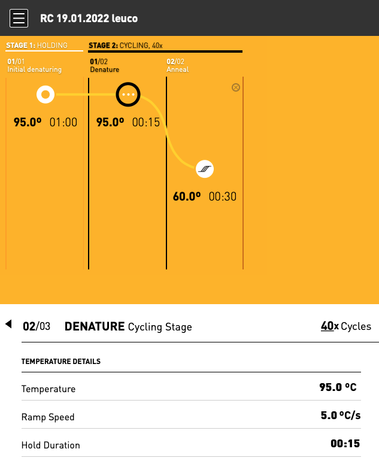
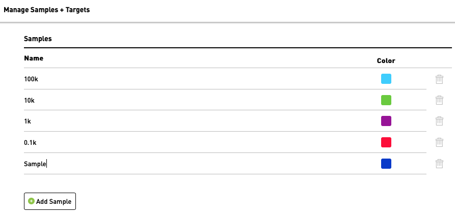
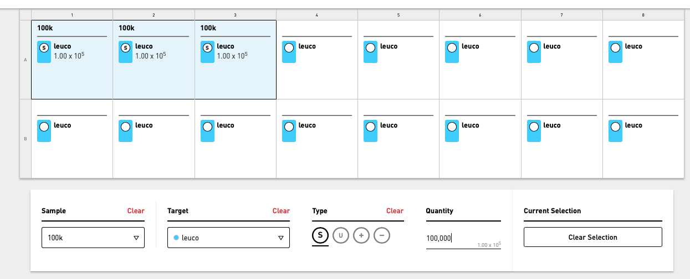
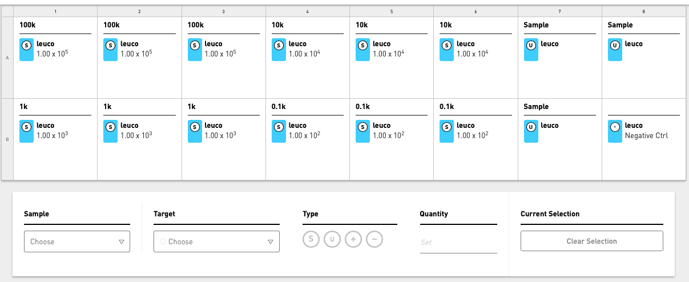
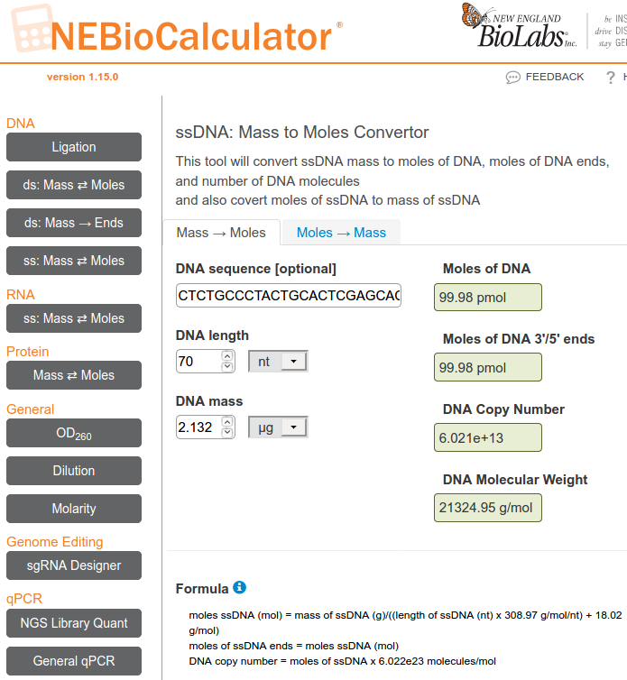
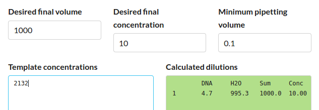
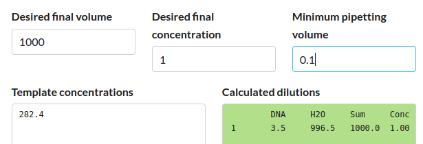

# Protocols for running species-specific qPCR assays for tilapia species
### Rupert Collins, Andy Saxon, Martin Genner :: March 2022

This protocol describes quantitative PCR (qPCR) assays to detect three species of tilapia cichlid present in Tanzanian aquaculture: _Oreochromis leucostictus_ (blue-spotted tilapia), _Oreochromis niloticus_ (Nile tilapia), and _Oreochromis urolepis_ (Wami tilapia). 

### Before you start

#### Equipment required (suppliers and part numbers are presented in [Appendix 1](#appendix-1)):

* Thermocycler (Chai Bio Open qPCR machine) 
* Laptop computer
* Pipettes and filtered pipette tips (10-20 &micro;L, 200 &micro;L, 1000 &micro;L)
* 1.5 mL microcentrifuge tubes
* Bench-top vortex
* Bench-top tube spinner
* Plastic tube racks
* Lab note book
* 10% bleach in squeezy wash bottle 
* 70% ethanol in squeezy wash bottle
* Paper towels
* Disposible gloves

#### Reagents and aliquots required (suppliers and part numbers are presented in [Appendix 1](#appendix-1)):

Note: These reagents need to stored frozen in dedicated boxes at -20&#176;C when not in use, and to avoid cross contamination the eDNA samples and amplification standards need to be stored in separate boxes to the assay reagents and from each other.

* Chai Bio Sahara Hot Start PCR Master Mix
* Nuclease free "ultrapure" water in 1 mL aliquots
* TE buffer in 1 mL aliquots
* Premixed primer+probe (PPM) in 50 &micro;L aliquots
* Your eDNA sample template DNA
* qPCR assay amplification standards at a one billion copy/&micro;L stock solution

#### Before each experiment:

* Wipe down the bench surfaces with 70% ethanol followed by 10% bleach, followed by 70% ethanol (the "EBE" clean). Do NOT bleach the qPCR machine.
* Ensure you have sufficient gloves, tips, tip disposal jars, tubes etc.
* Ensure all reagent working stocks are sufficient and defrosted.

### Preparing the primer and probe stocks

* PCR primer and hydrolysis probe oligonucleotide sequences for each species assay are found in [Appendix 2](#appendix-2).
* Primers and probes are shipped dry and must be reconstituted to 100 &micro;M following synthesis instructions enclosed with the order.
* These 100 &micro;M stocks should be divided into several 20 &micro;L aliquots to minimise contamination risk.
* Probes are sensitive to light, and should be kept in the dark were possible while defrosted on the lab bench.
* Make 50 &micro;L premixes of combined primer+probe mix (PPM) to save time and reduce stock contamination.
* These mixes defrosted as required, and should be made in small volumes to minimise freeze-thaw damage.

1. Vortex all reagents, and in a 1.5 mL microcentrifuge tube for a total volume of 50 &micro;L, combine as follows:

| Reagent | Stock conc. (&micro;M) | Volume add (&micro;L) |
| :--- | ---: | ---: |
| Forward PCR primer | 100 | 4 |
| Reverse PCR primer | 100 | 4 |
| Hydrolysis probe | 100 | 2 |
| TE buffer | NA | 40 |

### Preparing the eDNA field samples

* The eDNA field samples may contain naturally occuring PCR inhibitors such as humic acids that are co-extracted with the eDNA. These will be more likely in turbid, sediment rich ponds.
* Eluted eDNA templates with high amounts of inhibitors are typically tinged with a brown coloration, rather than the expected clear solution.
* PCR inhibitors will reduce the efficiency of the PCR reaction and cause estimated concentrations to be lower than otherwise, or can even prevent all amplification altogether. 
* These PCR inhibitors can be removed by passing the sample through a Zymo OneStep PCR Inhibitor Removal column. For more information see [Sterivex eDNA extraction protocol](https://github.com/genner-lab/Molecular-Lab-Protocols/blob/main/sterivex-dneasy-extraction.md).
* Alternatively, the PCR inhibitors can be diluted with water down to less problematic levels, assuming eDNA levels remain sufficiently high to detect the species after dilution. 
* Here, perform a 1:5 dilution of eDNA template as follows:

1. Vortex the eDNA template, then add 3 &micro;L of this eDNA template to 1.5 mL microcentrifuge tube.
2. Next add 12 &micro;L of ultrapure water from a dedicated aliquot stock, and vortex.
3. This makes a 15 &micro;L volume of diluted DNA and can be used immediately in PCR reactions.
4. This dilution is unstable, however, due to the acidity of ultrapure water, and should not be stored longer than a few days. Make up fresh dilutions as required. Use TE buffer for longer storage.

### Preparing the quantification standards

* Quantification standards are synthetic single-stranded DNA molecules (oligonucleotides) of a known concentration. 
* These strands match the target DNA of the species that is being detected.
* They allow us to estimate the concentrations in our unknown eDNA samples, by applying a "standard curve" equation combining them with amplification data from the known concentrations. This step is performed by the Open qPCR machine.
* An appropriate range is around four to five points, ranging from 1 million copies to 10 copies. Here we use four points from 100,000 to 100 copies. 
* If samples are estimated outside this range, then shift the range up or down to fit.

1. Use a 1 billion copies/&micro;L working stock to make a 1:10 serial dilution of appropriate concentration, in volumes of 100 &micro;L.
2. Full instructions to make this 1 billion stock is found below in [Appendix 3](#appendix-3).
3. Prepare seven 1.5 mL microcentrifuge tubes and label them as follows:

| Dilution tube | Label | Stock | Copies/&micro;L |
| :--- | :--- | :--- | ---: |
| 1 | 100M | 100 million | 100,000,000 |
| 2 | 10M | 10 million | 10,000,000 |
| 3 | 1M | 1 million | 1,000,000 |
| 4 | 100K | 100 thousand | 100,000 |
| 5 | 10K | 10 thousand | 10,000 |
| 6 | 1K | 1 thousand | 1,000 |
| 7 | 0.1K | 1 hundred | 100 |

4. Add 90 &micro;L ultrapure water to each of the seven labelled tubes.
5. From the 1 billion copies/&micro;L working stock, add 10 &micro;L to dilution tube 1 (100M), and vortex.
6. From this 100M tube, take 10 &micro;L and add it to dilution tube 2 (10M), and vortex.
7. From this 10M tube, take 10 &micro;L and add it to dilution tube 3 (1M), and vortex.
8. Repeat this for all tubes until the final 0.1K tube.
9. The 100M, 10M, and 1M tubes can be discarded as they are not being used as quantification standards in this example experiment.
10. These quantification standards can be kept in the refrigerator for no longer than 24 h before discarding and making fresh dilutions.
11. Aliquots can be made and frozen if they are to be used in a short space of time, e.g. within a week. They will degrade if stored for longer. 

### Connecting the qPCR machine:

Note: Calibration of Open qPCR machine may be necessary on initial installation. See machine manual found at [Open_qPCR_User_Manual.pdf](https://static.chaibio.com/spree/products/114/Open_qPCR_User_Manual.pdf).

1. Connect laptop to Open qPCR machine via USB cable. Start machine. it will take around 5 mins to complete the boot sequence.
2. All commands to operate the Open qPCR machine are interfaced via your web browser.
3. When the boot sequence has completed, open a web browser (e.g. Google Chrome) on the laptop and type "192.168.7.2" into the address bar. Log into the machine.

### Setting the thermocycling conditions

1. On the Welcome page, select "Create a new experiment" and name it with the date and any additional details
2. On the Edit Protocol page, now set up cycling conditions as follows for the Chai Bio Sahara Master Mix (these conditions may not apply to other master mixes or assays).

| PCR Step | Time | Temperature | Number cycles |
| :--- | :--- | :--- | :--- |
| Initial denaturation | 1 min | 95&#176;C | 1 (holding) |
| Denaturation | 15 s | 95&#176;C | 40 |
| Annealing | 30 s | 60&#176;C | 40 |

### Setting the samples and targets

1. On the Samples + Targets page (see Figure 2), add names of the samples and amplification standards used in the experiment.
2. Here, the standards are named with the number of copies, in thousands, from 100,000 (100k) to 100 copies (0.1k).
3. Our unknown field sample is simply called "Sample" in this example.

#### Figure 2. Samples

4. Next add the target. This is the name of the species detection assay that we are using.
5. Here we named the target assay "leuco" as we used the _Oreochromis leucostictus_ assay, otherwise "nilo" or "uro".

### Setting the well layout

1. Each standard or field sample should be performed in triplicate to reduce variation common among individual replicates.
2. Highlight all wells and set the target to "leuco" from the Target drop-down menu.
3. Now highlight three wells (A1, A2, A3) and choose a "100k" standard from the Sample drop-down menu.
4. Choose "S" (standard) from the Type menu, and manually enter "100000" into the set quantification to 100,000 copies.

5. Repeat for all quantification standards down to 100 copies. Be sure to check they match with the names given and have the correct number of zeros.
6. For our field samples, assign these to wells A7, A8, B7, choose "Sample" and Type "U" (unknown).
7. Add an additional well (B8) as a negative control (Type "-").

### Preparing the PCR reaction mix

1. In a clean 1.5 mL microcentrifuge tube prepare a PCR reaction mix sufficient for x16 10 &micro;L PCR reactions.
2. We prepare enough reagents for 17, to account for loss from pipetting error or evaporation.
3. Add the volume with the appropriate pipette for maximum accuracy.
4. The 

### Table XXX. A 10 &micro;L PCR reaction mix for x16 wells
| Addition | Reagent | Volume x 1 (&micro;L) | Volume x17 (&micro;L) |
| :--- | :--- | ---: | ---: |
| combined | Sahara Hot Start PCR Master Mix | 5 | 85 |
| combined | primer+probe mix | 0.5 | 8.5 |
| combined | ultrapure water | 3.5 | 59.5 |
| individual | sample/standard/control | 1 | NA |

5. Vortex to mix the reagents well
6. Add 9 &micro;L of this mixture to each 0.1 mL PCR tube well.
7. Put away all reagents stocks back in the freezer.

### Adding the standards and eDNA field samples

1. To the Negative Control "-" well B8, add 1 &micro;L of ultrapure water. 
2. To the Unknown field sample "U" wells A7, A8, B7, add 1 &micro;L of the eDNA field sample.
3. To the Standards "S" wells, add 1 &micro;L of DNA quantification standard at the appropriate concentration, i.e. matching up with the prepared concentrations and the well layout described above.
4. Close the caps firmly, and spin down the tubes to collect liquid at the bottom of the tubes.
5. These are now ready for loading onto the machine.

### Running the qPCR

1. 

3. Dilute field sample!
3. To minimise risk of cross contamination, it is important to add the negative control water first, followed by eDNA field sample, followed by quantification standards.
4. Prepare the quantification standards on a seperate bench area and put away the 
4. Further, ensure that pipettes that are used for handling quantification standards are never used for preparing the PCR reactions or eDNA field samples.
5. ff

### Considerations

1. Run all without standards, and then repeat with standards for those positive.
2. This is to verify that the reagents are not contaminated with target DNA.

### Appendix 1

#### Suppliers and part numbers

| Type | Item | Supplier | Part no. |
| :--- | :--- | :--- | :--- |
| equipment | Open qPCR machine | Chai Bio | Single channel |
| equipment | Pipette starter pack (4x pipettes) | Starlab UK | STARTERPACK42.5 |
| equipment | Vortamix Mini Vortexer | SLS | ARG1878 |
| equipment | Mini Fuge tube spinner | SLS | N2631-0017 |
| equipment | 250 mL wash bottle | SLS | BOT9000 |
| equipment | 96-well 1.5 mL microcentrifuge tube rack | Starlab UK | I2396-5048 |
| equipment | 96-well 0.2 mL PCR tube rack | Starlab UK | E2396-5240 |
| equipment | 81-tube freezer storage box | Starlab UK | I2381-5040 |
| consumable (plastic) | 10/20 &micro;L pipette filter tips | Starlab UK | S1120-3710 |
| consumable (plastic) | 200 &micro;L pipette filter tips | Starlab UK | S1120-8710 |
| consumable (plastic) | 1000 &micro;L pipette filter tips | Starlab UK | S1122-1730 |
| consumable (plastic) | 1.5 mL microcentrifuge tube | Starlab UK | S1615-5510 |
| consumable (plastic) | 0.1 mL qPCR 8-well tube strips | Chai Bio | S02132B |
| consumable (reagent) | Chai Bio Sahara Hot Start PCR Master Mix | Chai Bio | R02151M |
| consumable (reagent) | Nuclease-free ultrapure water | Thermo Fisher Scientific | 10977035 |
| consumable (reagent) | qPCR assay primers and probes | Eurofins Genomics | as required |
| consumable (reagent) | Zymo OneStep PCR Inhibitor Removal kit | Cambridge Bioscience | D6030
| consumable (reagent) | TE Buffer | Thermo Fisher Scientific | 12090015

### Appendix 2

#### Oligonucleotide sequences for PCR primers and hydrolysis probes

* The 5&prime; and 3&prime; probe modifications are shown as [FAM] and [BHQ1] respectively.

| Species | Assay | Oligo type | UoB code | Base pairs | Oligonucleotide sequence (5&prime; -> 3&prime;) |
| :--- | :--- | :--- | :--- | :--- | :--- |
| _Oreochromis leucostictus_ | leuco | Primer Fwd | leuco.f2 | 19 | CTCTGCCCTACTGCACTCG |
| _Oreochromis leucostictus_ | leuco | Primer Rev | leuco.r2.new | 22 | CATGGGGCTTATACGGATGAGA |
| _Oreochromis leucostictus_ | leuco | Probe | leuco.p2 | 25 | [FAM] AGCACCATAGTCGTAGCCGGCATCT [BHQ1] |
| _Oreochromis niloticus_ | nilo | Primer Fwd | nilo.f3.new1 | 22 | TGGAGGTTTTACCCTACAGACC |
| _Oreochromis niloticus_ | nilo | Primer Rev | nilo.r3.new | 19 | GTCGAAGGGAGCTCGGTTA |
| _Oreochromis niloticus_ | nilo | Probe | nilo.p3 | 28 | [FAM] AGTGTCTGACTAATCCTTCCCGCCTGAC [BHQ1] |
| _Oreochromis urolepis_ | uro | Primer Fwd | uro.f6.new | 22 | CTAAGCCTCGTGTTAACTCCAG |
| _Oreochromis urolepis_ | uro | Primer Rev | uro.r6.new | 22 | TTTGATGTATTCGGCAGGTGGA |
| _Oreochromis urolepis_ | uro | Probe | uro.p6.new | 26 | [FAM] CAACGTCAACAACAACACTCACGCCC [BHQ1] |

### Appendix 3

#### Oligonucleotide sequences for quantification standards

| Species | Assay | Base pairs | Oligonucleotide sequence (5&prime; -> 3&prime;) |
| :--- | :--- | :--- | :--- |
| _Oreochromis leucostictus_ | leuco | 70 | CTCTGCCCTACTGCACTCGAGCACCATAGTCGTAGCCGGCATCTTCCTTCTCATCCGTATAAGCCCCATG |
| _Oreochromis niloticus_ | nilo | 127 | TGGAGGTTTTACCCTACAGACCTTTAGCATTGCTCAAGAAAGTGTCTGACTAATCCTTCCCGCCTGACCTTTAGCCGCTATATGATACATTTCCACACTTGCAGAAACTAACCGAGCTCCCTTCGAC |
| _Oreochromis urolepis_ | uro | 95 | CTAAGCCTCGTGTTAACTCCAGTACCACAAACAACGTCAACAACAACACTCACGCCCCCAACACCAAAACACCTCCACCTGCCGAATACATCAAA |

#### Diluting quantification standards

* IMPORTANT: the standards are supplied dried and HIGHLY concentrated, and must be prepared in a separate area and using separate pipettes to those used for DNA extraction and PCR reaction preparation. Bleach the area thoroughly after use.
* All traces of them must be kept seperate from the other reagents because they are indistinguishable from real tilapia DNA and can lead to severe false positive contamination problems.
* Always use TE buffer to dilute the stocks of quantification standards. Ultrapure water can be used for serial dilutions as these will be discarded after use.
* Prepare the standards as follows (initial steps only need to be done once):

1. Spin down the supplied oligo tubes to collect the dried oligonucleotides.
2. If shipped at 4 nmol, add 40 &micro;L of TE buffer to dilute to 100 pmol/&micro;L.
3. Incubate for 5 min at room temperature, and vortex for 1 min.
4. Use the online [NEBioCalculator](https://nebiocalculator.neb.com/#!/ssdnaamt) to calculate the mass of DNA given the molarity.
5. Select the "Moles -> Mass" tab, and paste the full DNA sequence (from Table XXX below), and set the DNA moles to 100 pmol.
6. The result is a DNA mass of 2.132 &micro;g/&micro;L (= 2132 ng/&micro;L).

7. Now move to the "Mass -> Moles" tab insert the DNA mass of 2.132 &micro;g.
8. The result is a DNA copy number of 6.021e+13 or 60 trillion, 210 billion copies per microlitre.

9. To make a 10 ng/&micro;L stock in 1 mL volume, add 4.7 &micro;L of 100 pmol/&micro;L stock to 995.3 &micro;L TE buffer.
10. Can use an [online dilution calculator](http://www.desiquintans.com/dilutioncalc) as follows: 

6. Recalculate the DNA copy number of this 10 ng/&micro;L stock = 2.824e+11 copy/&micro;L (282.4 billion copies).
7. Dilute again down to a 1 billion copy/&micro;L stock by adding 3.5 &micro;L of 10 ng/&micro;L stock to 996.5 &micro;L TE buffer.

|  |
| ------ |

|  |
| :---: |

8. These stocks should be frozen and kept in different boxes to the PCR reagents.
